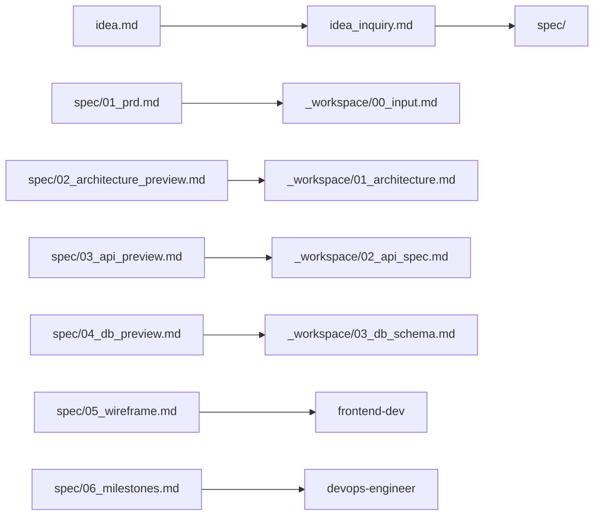

# Spec Check — 사전 기획/설계 프리뷰

`fullstack-webapp`의 구현 파이프라인으로 넘어가기 전,  
**제품의 형상을 미리 보는 문서**를 생성한다.

`_workspace/` 체계를 대체하는 것이 아니라,  
**한 단계 앞선 초안/프리뷰**로서 구현팀의 더 나은 인풋 데이터가 되는 것이 목적이다.

## 실행 조건

다음 중 하나라도 해당하면 이 스킬을 실행한다:
- `idea_inquiry.md`가 LGTM 상태임
- 사용자가 `/spec_check`를 명시적으로 호출함
- `fullstack-webapp` Phase 0에서 조건부로 호출됨

## 실행 순서

### Step 1: 입력 확인

1. `idea_inquiry.md`를 읽어 충분성을 확인한다
2. `idea.md`가 있으면 함께 참조한다
3. 정보가 부족하면 `/idea_miner` 실행을 먼저 안내한다

### Step 2: architect 에이전트를 통한 spec/ 생성

`architect` 에이전트를 활용해 아래 문서들을 `spec/` 폴더에 생성한다.

| 파일 | 내용 | _workspace/ 연동 |
|------|------|-----------------|
| `spec/01_prd.md` | 제품 요구사항 정의서 | → `_workspace/00_input.md`, `01_architecture.md` 입력 |
| `spec/02_architecture_preview.md` | 시스템 아키텍처 초안 | → `_workspace/01_architecture.md` 초안 |
| `spec/03_api_preview.md` | API 초안 | → `_workspace/02_api_spec.md` 초안 |
| `spec/04_db_preview.md` | DB 초안 + ERD | → `_workspace/03_db_schema.md` 초안 |
| `spec/05_wireframe.md` | 화면 설계/와이어프레임 | → frontend-dev 인풋 |
| `spec/06_milestones.md` | 개발 일정 및 마일스톤 | → devops-engineer 인풋 |
| `spec/index.md` | spec/ ↔ _workspace/ 관계 설명 | 참조용 |

### Step 3: 각 문서 작성 기준

#### `spec/01_prd.md` — 제품 요구사항 정의서

```markdown
# PRD — [제품명]

## 제품 개요
- **한 줄 요약**: [문장]
- **해결하는 문제**: [설명]
- **타겟 사용자**: [페르소나]
- **핵심 가치 제안**: [USP]

## 기능 요구사항
### P0 — 반드시 있어야 함
| 기능 | 사용자 스토리 | 수락 기준 |
|------|-------------|----------|

### P1 — 있으면 좋음
### P2 — 나중에

## 비기능 요구사항
| 항목 | 요구사항 | 비고 |
|------|---------|------|
| 성능 | | |
| 보안 | | |
| 확장성 | | |

## 사용자 여정
(주요 시나리오별 단계별 흐름)

## 제외 범위 (Out of Scope)
(MVP에서 의도적으로 제외하는 것)
```

#### `spec/02_architecture_preview.md` — 아키텍처 초안

```markdown
# 시스템 아키텍처 초안

## 추천 기술 스택
| 구분 | 기술 | 선택 근거 |
|------|------|----------|

## 시스템 구성도
```mermaid
graph TB
  [아키텍처 다이어그램]
```

## 주요 컴포넌트
## 데이터 흐름
## 확장 고려사항
```

#### `spec/03_api_preview.md` — API 초안

```markdown
# API 초안

## 핵심 엔드포인트 목록
| Method | Path | 설명 | 인증 |
|--------|------|------|------|

## 주요 요청/응답 예시
## 인증 방식
## 에러 코드 규약
```

#### `spec/04_db_preview.md` — DB 초안

```markdown
# DB 초안

## 핵심 엔티티 목록
[주요 명사/엔티티]

## ERD
```mermaid
erDiagram
  [ERD 다이어그램]
```

## 테이블 초안
### [테이블명]
| 컬럼 | 타입 | 설명 |
|------|------|------|

## 관계 설명
## 인덱스 전략 초안
```

#### `spec/05_wireframe.md` — 화면 설계

```markdown
# 화면 설계 / 와이어프레임

## 페이지 목록
| 페이지 | 경로 | 설명 | 주요 컴포넌트 |
|--------|------|------|-------------|

## 페이지별 레이아웃

### [페이지명]
```
[ASCII 또는 텍스트 기반 와이어프레임]
┌─────────────────────────┐
│ Header                  │
├─────────────────────────┤
│ [컴포넌트 구성]          │
└─────────────────────────┘
```

## 사용자 플로우
```mermaid
flowchart LR
  [플로우 다이어그램]
```

## 핵심 상태 다이어그램

```

#### `spec/06_milestones.md` — 마일스톤

```markdown
# 개발 일정 및 마일스톤

## Phase별 목표
| Phase | 목표 | 포함 기능 | 기간 추정 |
|-------|------|----------|---------|
| MVP | [목표] | P0 기능 | [주] |
| v1.0 | [목표] | P0+P1 | [주] |
| v2.0 | [목표] | 전체 | [주] |

## 칸반 보드 초안
### To Do (백로그)
### In Progress (MVP)
### Done (완료 기준)

## 기술 부채 / 이후 결정 필요 항목
```

#### `spec/index.md` — 관계 설명

```markdown
# Spec → Workspace 매핑 가이드

## 문서 관계도


## 에이전트별 spec/ 활용 프로토콜

| 에이전트 | 참조할 spec/ 문서 | 활용 방식 |
|---------|----------------|---------|
| architect | 01, 02, 03, 04 | `_workspace/` 상세 설계의 입력 초안으로 활용 |
| frontend-dev | 01, 05 | UI 컴포넌트 구조, 페이지 구성 참고 |
| backend-dev | 01, 03, 04 | API/DB 명세 참고, 비즈니스 로직 파악 |
| qa-engineer | 01, 05 | 사용자 시나리오 기반 테스트 케이스 도출 |
| devops-engineer | 02, 06 | 인프라 요구사항, 배포 일정 참고 |

## spec/ → _workspace/ 승격 규칙

1. architect가 `_workspace/` 작성 시 `spec/` 문서를 **반드시 참고**한다
2. `spec/`의 내용이 확정되면 `_workspace/`로 상세화하여 이관한다
3. `spec/`에 명시된 가정 사항은 `_workspace/`에서 반드시 검증한다
4. 상충 시 `_workspace/`가 우선한다 (spec/은 초안, _workspace/는 확정본)
```

### Step 4: 완료 후 안내

```
✅ spec/ 생성 완료

생성된 문서:
- spec/01_prd.md          — 제품 요구사항 정의서
- spec/02_architecture_preview.md — 아키텍처 초안
- spec/03_api_preview.md  — API 초안
- spec/04_db_preview.md   — DB 초안 + ERD
- spec/05_wireframe.md    — 화면 설계
- spec/06_milestones.md   — 마일스톤
- spec/index.md           — spec/ ↔ _workspace/ 관계 설명

다음 단계:
→ spec/ 문서를 검토하고 수정할 부분이 있으면 알려주세요
→ 확인 완료 후 `/fullstack-webapp`으로 구현 파이프라인을 시작합니다
```

## 작성 원칙

- 모든 문서는 **마크다운 기반**
- 도식은 **Mermaid.js** 우선 사용
- 예쁜 기획 문서가 아니라 **구현팀이 즉시 참조 가능한 밀도**를 목표로
- `spec/`와 `_workspace/`는 **상호 매핑 가능**해야 함
- `spec/`는 초안이므로 완벽하지 않아도 됨 — 구현 중 갱신 가능

## 에러 핸들링

| 상황 | 대응 |
|------|------|
| `idea_inquiry.md` 없거나 부족 | `/idea_miner` 먼저 실행 안내 |
| 특정 정보 부족 | 해당 섹션에 `[TBD]` 명시 후 계속 진행 |
| `spec/` 이미 존재 | 기존 파일 덮어쓰기 전 사용자 확인 |

## 연동

- **입력**: `idea_inquiry.md`, `idea.md`
- **출력**: `spec/*.md`
- **활용처**: `architect`, `frontend-dev`, `backend-dev`, `qa-engineer`, `devops-engineer`
- **다음 단계**: `fullstack-webapp` Phase 1 (architect가 spec/를 참고해 _workspace/ 생성)
