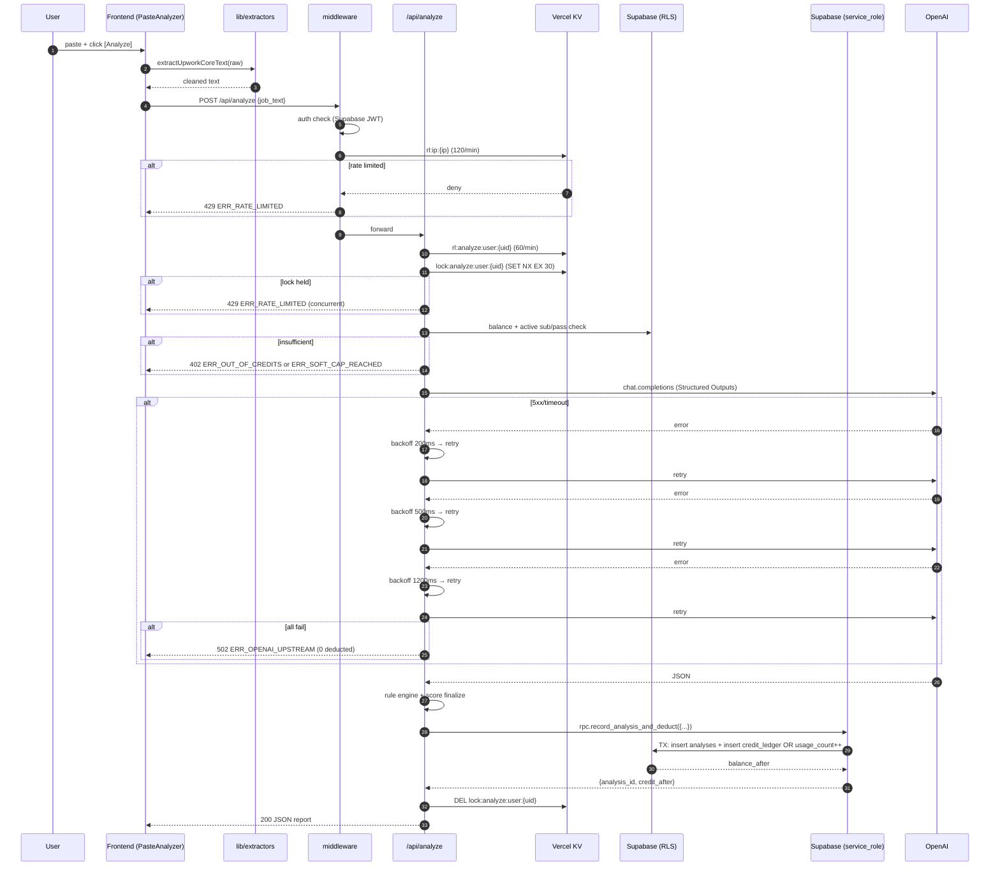
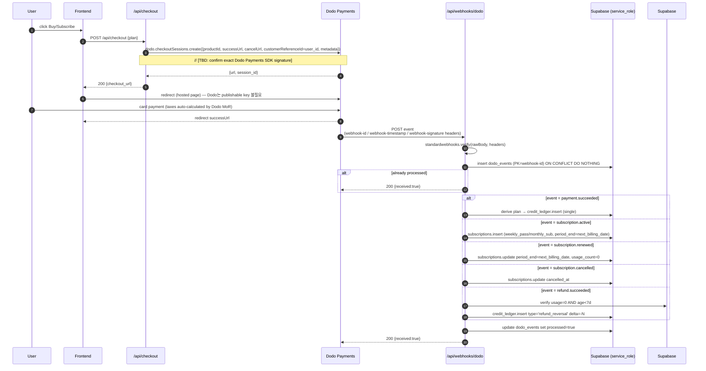
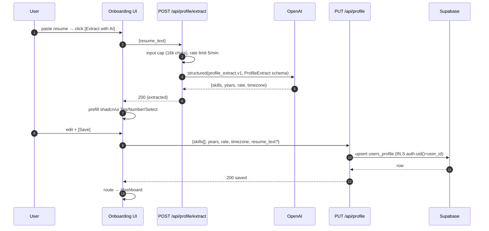

# 01_architecture.md — BidVett 시스템 아키텍처 확정본

> [PIVOT-01 rev2 — 2026-05-29] 결제 인프라 Stripe → Dodo Payments. §0 변경 메모, §4 다이어그램, §5 디렉토리, §6.7, §7.2, §8.4, §9, §10, §11, §12, §13 모두 갱신. 결정 매트릭스는 `_workspace/00_input.md §11`.
> 상위 문서: `_workspace/00_input.md`
> 초안 출처: `spec/02_architecture_preview.md` (🔒 FROZEN-rev2 2026-05-29)
> 본 문서는 spec/ 초안을 **구현 단계 확정본**으로 상세화한다. spec/ 자체는 PIVOT-01에 한해 rev 2로 갱신됨.
> 상충 시 우선순위: **본 문서 > spec/02 > idea_inquiry.md**

---

## 0. 변경 메모 (vs spec/02)

| 항목 | spec/02 표기 | 본 문서 확정 | 사유 |
|------|-------------|------------|------|
| Sentry 도입 | `[가정]` | **확정 도입** (Free tier, server+client DSN 동일) | Silent Retry 가시성·OpenAI 실패율 모니터링이 운영 필수 (TD-5) |
| Email 채널 | `[TBD]` | **MVP에서 미도입** (v1.0 Week 3 Resend로 결정 예약) | spec/06 §3 MVP scope 정렬. devops가 v1.0 진입 직전 최종 결정 |
| 세금 처리 (구 Stripe Tax) | ~~`[가정] MVP OFF, v1.1에서 Stripe Tax 검토`~~ | **Dodo Payments가 Merchant of Record로 VAT/GST/Sales Tax 자동 처리. 별도 활성화 불필요. (자동 처리됨, 완료)** | PIVOT-01 (`_workspace/00_input.md §11.4`) — TD-7 종결 |
| KV 키 네임스페이스 | 미명세 | §5에서 prefix/TTL/알고리즘 정식 규약 | 구현 시 충돌 방지 |
| LLM 입력 토큰 캡 | 64k chars / 16k chars 혼재 표기 | **char 64k (HTTP reject), pre-processor 후 LLM 입력 ≤ 16k chars / ≤ 4k tokens** | spec/01 §3 NFR + spec/02 §6 일치 |
| **결제 인프라 (PIVOT-01)** | Stripe (rev 1) | **Dodo Payments (Hosted Checkout + Standard Webhooks)** | 사용자 직접 지시 (2026-05-29). 비즈니스 모델/가격/환불 정책 불변 |

---

## 1. 프로젝트 개요

- **프로젝트명**: BidVett
- **한 줄 요약**: Upwork 공고 이중 리스크 스크리닝 SaaS (정량 Rule Engine + 정성 LLM)
- **타깃 사용자**: Upwork 글로벌 1~5년 차 프리랜서 (자세한 페르소나는 `spec/01_prd.md` §1)
- **프로젝트 규모**: 소규모 (MVP, 1인 풀스택 + Vercel + Supabase 단일 저장소)
- **언어/로케일**: English-only (Q5)
- **배포**: Vercel (Frontend + Route Handlers) + Supabase Cloud + Vercel KV + OpenAI + Dodo Payments

## 2. 기능 요구사항 (요약)

상세는 `spec/01_prd.md` §2 참조. P0(FR-1~FR-12)이 MVP 범위.

| 카테고리 | 항목 |
|---------|------|
| 인증 | FR-1 Google OAuth |
| 프로필 | FR-2 Profile Onboarding (Hybrid: free-text → LLM 4필드 추출 → 사용자 확정 → DB upsert) |
| 분석 코어 | FR-3 Paste & Analyze · FR-4 정량 Rule Engine · FR-5 정성 LLM Risk · FR-6 Match Score 40/30/30 · FR-7 Report |
| 신뢰성 | FR-8 Pre-check + Silent Retry ×3 + Deduct-on-Success |
| 결제 | FR-9 Dodo Payments 3 tiers · FR-10 Refund Sync · FR-12 Pricing Page |
| 신고 | FR-11 Report Scam |

## 3. 비기능 요구사항 (확정값)

| # | 항목 | 확정값 | 비고 |
|---|------|-------|------|
| NFR-1 | `/api/analyze` 지연 | **p50 < 3s, p95 < 6s** | OpenAI gpt-4o-mini 기준. qa가 1주차에 측정 (TD-1 후속) |
| NFR-2 | LLM 입력 사이즈 | **pre-processor 후 ≤ 16k chars / ≤ 4k tokens** | HTTP 진입 cap 64k chars |
| NFR-3 | 가용성 | 99.5% / month | Vercel + Supabase SLA 의존 |
| NFR-4 | Rate Limit `/api/analyze` | **per-user 60/min, per-IP 120/min, 동시 1 (in-flight lock)** | Vercel KV sliding window |
| NFR-5 | Rate Limit `/api/profile/extract` | per-user 5/min, per-IP 10/min | OpenAI 비용 가드 |
| NFR-6 | Soft Cap | weekly_pass 100/주, monthly_sub 500/월 | Pre-check에서 차단 |
| NFR-7 | RLS | 모든 user-owned 테이블 `auth.uid() = user_id` | `system_prompts`, `dodo_events`는 service_role only |
| NFR-8 | Webhook 보안 | Standard Webhooks 헤더 3종(`webhook-id` / `webhook-timestamp` / `webhook-signature`) HMAC-SHA256 검증 — `standardwebhooks` npm 권장 | 실패 시 400 `ERR_WEBHOOK_SIGNATURE` |
| NFR-9 | Secrets | Vercel Encrypted Env Vars만 (client 노출 변수는 `NEXT_PUBLIC_` prefix만) | §6 표 |
| NFR-10 | 관측성 | Sentry (Server+Client) + Vercel Analytics + Supabase Logs | Sentry 확정 도입 |
| NFR-11 | 비용 가드 | OpenAI Daily per-user cap = `min(soft_cap, 200)` 호출 / day | KV counter `cost:daily:{user_id}` |

## 4. 시스템 구성도

```mermaid
graph TB
  subgraph Client["Client (Browser)"]
    UI["Next.js App Router UI<br/>(shadcn/ui + Tailwind)"]
    Extractor["lib/extractors/upwork.ts<br/>(text-only Pre-processor)"]
  end

  subgraph Vercel["Vercel Serverless (Next.js)"]
    RSC["RSC / Server Components"]
    MW["middleware.ts<br/>(Auth + Rate Limit)"]
    API["Route Handlers /api/*"]
    Rules["lib/risk-engine<br/>(rules.ts + score.ts)"]
    OpenAIClient["lib/openai<br/>(client.ts, schemas.ts, prompts.ts)"]
    DodoClient["lib/dodo<br/>(client.ts, webhook.ts, plans.ts)"]
    KVClient["lib/rate-limit/kv.ts"]
    SupaServer["lib/supabase/server.ts"]
    SupaAdmin["lib/supabase/admin.ts<br/>(service_role)"]
  end

  subgraph Supabase["Supabase Cloud"]
    Auth["Supabase Auth<br/>(Google OAuth)"]
    PG[("PostgreSQL 15<br/>+ RLS")]
    RPC["RPC: record_analysis_and_deduct()"]
    Trig["Trigger: grant_free_credits_on_signup()"]
  end

  subgraph VercelKV["Vercel KV (Upstash Redis)"]
    KV[("rl:* · cost:* · lock:* · hash:*")]
  end

  subgraph External["External"]
    OpenAI["OpenAI API<br/>(gpt-4o-mini, Structured Outputs)"]
    Dodo["Dodo Payments<br/>(Hosted Checkout + Standard Webhooks, MoR)"]
    Sentry["Sentry"]
  end

  UI --> Extractor
  Extractor -->|cleaned text| API
  UI --> RSC
  RSC --> SupaServer
  SupaServer --> PG
  API --> MW
  MW --> Auth
  MW --> KVClient
  KVClient --> KV
  API --> OpenAIClient
  OpenAIClient --> OpenAI
  API --> Rules
  Rules --> Rules
  API --> SupaServer
  API --> SupaAdmin
  SupaAdmin --> RPC
  RPC --> PG
  Auth --> Trig
  Trig --> PG
  Dodo -->|Webhook signed<br/>(Standard Webhooks)| API
  API --> DodoClient
  DodoClient --> Dodo
  API --> Sentry
  RSC --> Sentry
```

## 5. 디렉토리 구조

```
src/
├── app/
│   ├── (marketing)/
│   │   ├── page.tsx                          # Landing
│   │   └── pricing/page.tsx
│   ├── (auth)/
│   │   └── login/page.tsx
│   ├── (app)/
│   │   ├── onboarding/page.tsx
│   │   ├── dashboard/page.tsx
│   │   ├── account/page.tsx
│   │   └── analyses/[id]/page.tsx
│   ├── api/
│   │   ├── auth/callback/route.ts
│   │   ├── profile/extract/route.ts
│   │   ├── profile/route.ts
│   │   ├── analyze/route.ts
│   │   ├── analyses/route.ts
│   │   ├── analyses/[id]/route.ts
│   │   ├── credits/route.ts
│   │   ├── checkout/route.ts
│   │   ├── webhooks/dodo/route.ts
│   │   └── report-scam/route.ts
│   ├── error.tsx
│   ├── not-found.tsx
│   └── layout.tsx
├── components/
│   ├── ui/                                   # shadcn/ui generated
│   ├── analyze/PasteAnalyzer.tsx
│   ├── report/RiskBadge.tsx
│   ├── report/MatchScoreGauge.tsx
│   ├── report/ReportDialog.tsx
│   ├── pricing/PlanCard.tsx
│   └── nav/AppNav.tsx
├── lib/
│   ├── extractors/
│   │   ├── upwork.ts                         # spec/02 §3.3.1 본문 그대로
│   │   └── index.ts
│   ├── risk-engine/
│   │   ├── rules.ts                          # LOW_HIRE_RATE / PAYMENT_UNVERIFIED_ZERO_SPEND / LOW_RATING
│   │   └── score.ts                          # 40/30/30 weighting (pass-through verify)
│   ├── openai/
│   │   ├── client.ts                         # OpenAI SDK + Silent Retry x3
│   │   ├── schemas.ts                        # AnalysisResult, ProfileExtract Zod + JSON Schema
│   │   └── prompts.ts                        # system_prompts loader (60s in-memory TTL)
│   ├── supabase/
│   │   ├── server.ts                         # @supabase/ssr server client
│   │   ├── client.ts                         # browser client
│   │   └── admin.ts                          # service_role (server-only)
│   ├── dodo/
│   │   ├── client.ts                         # dodopayments SDK wrapper
│   │   ├── webhook.ts                        # Standard Webhooks verifier (standardwebhooks npm) + event router (5 events)
│   │   └── plans.ts                          # plan ↔ Dodo Product ID mapping
│   ├── rate-limit/
│   │   └── kv.ts                             # @vercel/kv sliding window
│   ├── sentry/
│   │   ├── client.config.ts
│   │   └── server.config.ts
│   ├── errors.ts                             # ERR_* code constants + serializer
│   └── types/
│       ├── api.ts                            # request/response DTO
│       └── db.ts                             # Supabase generated types
├── middleware.ts                             # Auth gate + per-IP rate limit
└── instrumentation.ts                        # Sentry init

supabase/
├── migrations/
│   ├── 0001_init_schema.sql                  # 6 tables + indexes
│   ├── 0002_rls_policies.sql                 # CREATE POLICY ...
│   ├── 0003_triggers_and_rpc.sql             # grant_free_credits_on_signup + record_analysis_and_deduct
│   └── 0004_seed_system_prompts.sql          # analyze.v1 + profile_extract.v1
└── config.toml

tests/
├── fixtures/
│   └── upwork-sample.txt                     # spec/02 §3.3.2 골든 픽스처
├── unit/
├── integration/
└── e2e/
```

## 6. 모듈별 책임 / 경계 / 계약

### 6.1 `lib/extractors/upwork.ts`
- **책임**: raw 텍스트 → 헤더/푸터 컷오프 + 공백 정규화. **DOM 의존 없음** (Chrome Extension·Node·Browser 동일 결과).
- **계약**: `extractUpworkCoreText(rawText: string): string`. spec/02 §3.3.1 본문 그대로 사용. 변경 금지.
- **호출처**: 프론트엔드 `PasteAnalyzer.tsx`에서 `[Analyze]` 클릭 시 즉시. 백엔드는 입력을 **그대로 신뢰하지 않고** char length 64k cap만 검사.
- **확장 트리거**: T1 픽스처 통과율 < 95% 또는 LLM 입력 토큰 p95 > 4k → v2 (DOM-aware / anchor segmentation).

### 6.2 `lib/risk-engine/rules.ts`
- **책임**: LLM 출력의 정량 4필드 → `CRITICAL_RISK` boolean + 트리거 룰 배열.
- **계약**:
  ```ts
  type QuantSignals = { client_hire_rate: number; payment_verified: boolean; total_spend_amount: number; client_rating: number };
  type RuleResult = { critical: boolean; rules_triggered: ('LOW_HIRE_RATE' | 'PAYMENT_UNVERIFIED_ZERO_SPEND' | 'LOW_RATING')[] };
  export function evaluate(q: QuantSignals): RuleResult
  ```
- **룰 임계값** (spec/03 §6.1 그대로):
  - `LOW_HIRE_RATE := client_hire_rate < 20`
  - `PAYMENT_UNVERIFIED_ZERO_SPEND := !payment_verified && total_spend_amount === 0`
  - `LOW_RATING := client_rating > 0 && client_rating <= 3.5`
- **순수 함수**: 부수 효과·DB 접근 없음. 단위 테스트 100% 커버리지 목표.

### 6.3 `lib/risk-engine/score.ts`
- **책임**: LLM이 반환한 `match_score` 검증 + DANGER/CRITICAL 시 `null` 마스킹.
- **계약**:
  ```ts
  export function finalizeScore(input: {
    llm_match_score: number;       // 0~100
    risk_level: 'SAFE' | 'WARNING' | 'DANGER';
    backend_critical: boolean;
  }): { match_score: number | null; verdict: 'SHOW_REPORT' | 'DO_NOT_APPLY' }
  ```
- **마스킹 규칙**: `risk_level === 'DANGER' || backend_critical` → `match_score = null`, `verdict = 'DO_NOT_APPLY'`. 그 외 `verdict = 'SHOW_REPORT'`.
- **40/30/30 가중치**는 LLM 프롬프트(analyze.v1) 측 책임. 백엔드는 LLM 출력값을 신뢰하고 범위·마스킹만 검증.

### 6.4 `lib/openai/client.ts`
- **책임**: OpenAI 호출 + Silent Retry ×3 + 토큰 길이 가드 + Sentry breadcrumb.
- **계약**:
  ```ts
  export async function callStructured<T>(args: {
    promptName: 'analyze.v1' | 'profile_extract.v1';
    userMessage: string;
    schema: JSONSchema7;            // Structured Outputs
    maxInputChars: number;          // 16_000
  }): Promise<T>
  ```
- **Silent Retry 알고리즘** (§8 참조).
- **에러 매핑**: 3회 모두 5xx/timeout → throw `OpenAIUpstreamError` → 라우트 핸들러가 `ERR_OPENAI_UPSTREAM`(502) 반환.

### 6.5 `lib/openai/prompts.ts`
- **책임**: `system_prompts` 테이블에서 `is_active=true` row 로드 + **in-memory TTL 60s 캐시**.
- **계약**:
  ```ts
  export async function getActivePrompt(name: 'analyze.v1' | 'profile_extract.v1'): Promise<{ version: number; content: string }>
  ```
- **폴백**: 테이블 조회 실패 시 `process.env.SYSTEM_PROMPT_VERSION`이 지정한 fallback (배포 시 1로 고정) → 그래도 없으면 `ERR_PROMPT_NOT_FOUND`(500).
- **하드코딩 금지**: 프롬프트 본문은 절대 코드에 박지 않는다 (spec/03 §7.1 운영 노트).

### 6.6 `lib/supabase/{server,client,admin}.ts`
- `server.ts`: `@supabase/ssr` cookie 세션. RLS 적용. 사용자 컨텍스트로 SELECT.
- `client.ts`: 브라우저 클라이언트. anon key만.
- `admin.ts`: **service_role**. RLS bypass. `credit_ledger` insert, `subscriptions` upsert, `system_prompts` 읽기 등 서버 전용 작업.

### 6.7 `lib/dodo/webhook.ts`
- **책임**: Standard Webhooks signature 검증 + 5개 이벤트 라우팅 + `dodo_events` 멱등성 기록.
- **서명 검증** (`standardwebhooks` npm 권장):
  ```ts
  // import { Webhook } from 'standardwebhooks';
  // const wh = new Webhook(process.env.DODO_WEBHOOK_SECRET!);
  const event = wh.verify(rawBody, {
    'webhook-id': headers.get('webhook-id')!,
    'webhook-timestamp': headers.get('webhook-timestamp')!,
    'webhook-signature': headers.get('webhook-signature')!,
  });
  // [TBD: confirm exact Dodo Payments SDK signature]
  ```
  자체 구현 시 timing-safe compare 실수 위험 — 라이브러리 사용 강력 권장.
- **처리 이벤트**:
  - `payment.succeeded` → one-time 결제(single) plan이면 `credit_ledger` insert. 구독 플랜은 `subscription.active`를 source of truth로 사용
  - `subscription.active` → 신규 weekly_pass/monthly_sub 활성화: `subscriptions` insert(`status='active'`, `period_end=next_billing_date`)
  - `subscription.renewed` → 구 `invoice.paid` 흡수. `subscriptions.period_end = next_billing_date`, `usage_count = 0`, `cancelled_at = null`
  - `subscription.cancelled` → `cancelled_at` 기록. 현재 paid period는 유지하고 다음 갱신은 차단
  - `refund.succeeded` → 0회 사용 + 7일 이내 검증 → 크레딧 무효화 (`credit_ledger` `type='refund_reversal'`, `delta`는 원 결제분과 동일 절댓값의 negative). subscription이면 `status='refunded'`.
- **멱등성**: 진입 첫 단계에 `dodo_events` insert (PK = Standard Webhooks `webhook-id` 헤더 값). 충돌 시 `processed=true`면 `200 OK` 즉시 반환.

### 6.8 `lib/rate-limit/kv.ts`
- **책임**: Sliding window rate limit (`@vercel/kv`).
- **계약**:
  ```ts
  export async function check(args: {
    key: string;            // 예: 'rl:analyze:user:8a4f...'
    windowSec: number;      // 60
    limit: number;          // 60
  }): Promise<{ allowed: boolean; remaining: number; resetAt: number }>
  ```
- **알고리즘**: Sorted Set sliding window — `ZADD <key> <now> <uuid>` → `ZREMRANGEBYSCORE <key> 0 <now - window>` → `ZCARD <key>` → 결과로 판단.
- **TTL**: `EXPIRE <key> <windowSec * 2>` (자동 정리).

### 6.9 `middleware.ts`
- **책임**: 모든 `/api/*` 진입 전 (1) Supabase 세션 검증 (2) per-IP rate limit (3) Sentry transaction 시작.
- **예외 경로**: `/api/webhooks/dodo` (Standard Webhooks signature 자체가 인증), `/api/auth/callback` (Public).
- **per-user rate limit는 라우트 핸들러 내부**에서 수행 (user_id 확보 후).

## 7. 데이터 흐름 (확정)

### 7.1 Analyze Flow



### 7.2 Payment Flow



### 7.3 Profile Onboarding Flow



## 8. 비용/안정성 가드 (확정)

### 8.1 Silent Retry 알고리즘 (Deduct-on-Success)

```pseudo
function callOpenAIWithRetry(req):
  attempts = [
    { delayBeforeMs:    0 },  # attempt 1
    { delayBeforeMs:  200 },  # attempt 2
    { delayBeforeMs:  500 },  # attempt 3
    { delayBeforeMs: 1200 },  # attempt 4 (final)
  ]
  # 총 호출 횟수 = 4 (initial + 3 retries) — spec/02 §6 'Silent Retry x3'
  lastErr = null
  for a in attempts:
    sleep(a.delayBeforeMs)
    try:
      resp = openai.chat.completions.create(req)
      return resp
    except (5xx, Timeout, NetworkError) as e:
      lastErr = e
      Sentry.addBreadcrumb({category:'openai.retry', data:{attempt:a, err:e}})
      continue
    except (4xx, SchemaValidationError) as e:
      # non-retriable
      throw e
  Sentry.captureException(lastErr, {tags:{ category:'openai.upstream' }})
  throw OpenAIUpstreamError(lastErr)
```

크레딧은 `record_analysis_and_deduct()` RPC가 성공한 직후에만 차감 (Deduct-on-Success). Pre-check은 `balance >= 1 OR (active sub/pass AND usage < soft_cap)` 검증만 수행 (변경 없음).

### 8.2 Soft Cap 카운터 위치

- **저장**: `subscriptions.usage_count` (DB authoritative — Postgres atomic update).
- **읽기**: Pre-check 단계 (RPC `record_analysis_and_deduct` 진입 직전 SELECT for snapshot, 실제 increment는 RPC 내부 트랜잭션에서 `UPDATE ... RETURNING usage_count`로 race-free).
- **KV mirror**: 사용하지 않음 (단일 source of truth = DB). Pre-check 정확성 > 절약.
- **리셋**: monthly_sub는 `invoice.paid` webhook에서 0 리셋. weekly_pass는 `period_end` 도달 시 `status='expired'`만 처리 (재구매가 새 row).

### 8.3 일일 호출 안전망

- KV counter `cost:daily:{user_id}` (TTL 24h 자정 PST 기준). 1 increment per successful analyze.
- 임계: `min(soft_cap, 200)`. 초과 시 `ERR_RATE_LIMITED`(429) + `details.reason='daily_safety_cap'`.

### 8.4 Dodo Webhook 보안 (Standard Webhooks)

- 진입 첫 줄에서 `standardwebhooks` npm 라이브러리로 검증:
  ```ts
  // import { Webhook } from 'standardwebhooks';
  const wh = new Webhook(process.env.DODO_WEBHOOK_SECRET!);
  const event = wh.verify(rawBody, {
    'webhook-id': req.headers.get('webhook-id')!,
    'webhook-timestamp': req.headers.get('webhook-timestamp')!,
    'webhook-signature': req.headers.get('webhook-signature')!,
  });
  // [TBD: confirm exact Dodo Payments SDK signature]
  ```
- 실패 시 400 `ERR_WEBHOOK_SIGNATURE`. `raw body` 보존을 위해 Next.js Route Handler에서 `req.text()` 사용 (JSON parse 금지).
- **자체 HMAC 구현 금지** — Standard Webhooks 스펙은 `${webhook-id}.${webhook-timestamp}.${body}` 페이로드를 HMAC-SHA256으로 서명하므로 timing-safe compare/Base64 디코딩/replay window를 모두 올바르게 처리해야 한다. 라이브러리 사용 강력 권장.

## 9. Vercel KV 키 네임스페이스 규약

| Prefix | 형식 | 용도 | TTL | 알고리즘 |
|--------|------|------|-----|---------|
| `rl:ip` | `rl:ip:{ip}` | per-IP rate limit (middleware) | 120s | sorted set sliding window (limit=120/60s) |
| `rl:analyze:user` | `rl:analyze:user:{user_id}` | per-user analyze 60/min | 120s | sorted set sliding window |
| `rl:extract:user` | `rl:extract:user:{user_id}` | per-user profile/extract 5/min | 120s | sorted set sliding window |
| `lock:analyze:user` | `lock:analyze:user:{user_id}` | 동시 1 in-flight 분석 강제 | 30s | `SET NX EX 30` mutex |
| `cost:daily:user` | `cost:daily:{user_id}` | 일일 호출 안전망 | 24h | `INCR` + TTL on first set |
| `hash:job` (v2) | `hash:job:{sha256}` | 동일 공고 재분석 캐시 (예약) | 24h | `GET/SET` JSON blob — **MVP 미사용** |
| `prompt:cache` | `prompt:cache:{name}` | 프롬프트 60s in-memory 폴백 (다중 worker 대비) | 60s | `GET/SETEX` |

**충돌 방지 규약**:
1. 모든 키는 위 표의 prefix로만 시작한다. 신규 prefix 추가 시 본 표 갱신.
2. user_id는 Supabase auth UUID 그대로 (소문자, 하이픈 포함).
3. IP는 `x-forwarded-for` 첫 번째 토큰 (Vercel 자동 주입).

## 10. 환경변수 (확정)

| 변수 | 용도 | 노출 | 출처 |
|------|------|------|------|
| `NEXT_PUBLIC_SUPABASE_URL` | Supabase URL | Client | Supabase Project Settings |
| `NEXT_PUBLIC_SUPABASE_ANON_KEY` | Supabase anon key | Client | Supabase Project Settings |
| `SUPABASE_SERVICE_ROLE_KEY` | service_role | Server-only | Supabase Project Settings (Secret) |
| `OPENAI_API_KEY` | OpenAI 호출 | Server-only | OpenAI Dashboard |
| `DODO_API_KEY` | Dodo Payments Server 호출 (`dodopayments` npm) | Server-only | Dodo Dashboard (test/live mode-specific) — `[TBD: confirm exact key prefix (e.g. dodo_test_...)]` |
| `DODO_WEBHOOK_SECRET` | Standard Webhooks HMAC-SHA256 검증 | Server-only | Dodo Dashboard → Webhook endpoint signing secret |
| `NEXT_PUBLIC_DODO_PRODUCT_SINGLE` | $0.99 Dodo Product ID | Client (UI display only) | Dodo Dashboard → Products (`single_credit_099`) |
| `NEXT_PUBLIC_DODO_PRODUCT_WEEKLY` | $4.99 Dodo Product ID | Client | Dodo Dashboard → Products (`weekly_pass_499`) |
| `NEXT_PUBLIC_DODO_PRODUCT_MONTHLY` | $19 Dodo Product ID | Client | Dodo Dashboard → Products (`monthly_19`) |
| `KV_URL` | Vercel KV connection | Server-only | Vercel KV (자동 주입) |
| `KV_REST_API_URL` | Vercel KV REST | Server-only | Vercel KV (자동 주입) |
| `KV_REST_API_TOKEN` | Vercel KV token | Server-only | Vercel KV (자동 주입) |
| `KV_REST_API_READ_ONLY_TOKEN` | Vercel KV RO | Server-only | Vercel KV (자동 주입) |
| `SENTRY_DSN` | Sentry DSN (server+client 동일) | Server + `NEXT_PUBLIC_SENTRY_DSN`로 client 별도 노출 | Sentry Project |
| `NEXT_PUBLIC_SENTRY_DSN` | Client Sentry | Client | 동일 값 OK |
| `SYSTEM_PROMPT_VERSION` | DB 조회 실패 시 fallback version | Server-only | 배포 시 `1` 고정 |
| `NEXT_PUBLIC_APP_URL` | OAuth redirect + Dodo Hosted Checkout success_url | Client | 환경별 (e.g. `https://app.bidvett.com`) |

**Email/SMTP 변수**: MVP 미도입 → v1.0 Week 3 진입 시 `RESEND_API_KEY` 추가 검토.

## 11. 인증/인가 모델

- **Identity provider**: Google OAuth via Supabase Auth (단일).
- **세션 전달**: `@supabase/ssr` cookie 세션. Middleware가 매 `/api/*` 요청에서 `getUser()`로 검증.
- **인가 계층**:
  - Route Handler 진입 시 `supabase.auth.getUser()` → `user.id` 확보.
  - DB SELECT: Supabase RLS (`auth.uid() = user_id`).
  - DB INSERT/UPDATE/DELETE (user-owned 테이블): service_role admin client 사용 (서버 로직이 검증 후 신뢰).
  - `system_prompts`, `dodo_events`: service_role 전용 (RLS deny by default).
- **새 가입자 처리**: `auth.users` insert 트리거 `grant_free_credits_on_signup()`이 `credit_ledger`에 `(type='free_grant', delta=+5, balance_after=5)` 자동 삽입.

## 12. 확장 트리거 (현재 MVP → 다음 단계)

| 항목 | MVP 상태 | 확장 트리거 |
|------|---------|-----------|
| Chrome Extension | `lib/extractors/upwork.ts`가 DOM 의존 없음으로 분리 완료 | **v2.0** — DAU>200 또는 사용자 요청 30건 누적 시 Manifest V3 익스텐션이 동일 모듈 import |
| Admin UI | 0 (Supabase Data Browser + Dodo Dashboard로 100% 운영) | **DAU>500** 또는 외주 인력 위임 필요 시 |
| LLM upgrade `gpt-4o-mini` → `gpt-4o` | `gpt-4o-mini` 단일 | **v2.x Pro tier** — 결제 plan에 `pro_monthly_sub` 추가 시 |
| Multi-tenant / Agency | 1인 1시트 | **v2.x** — Agency 요청 누적 시 `teams`, `memberships` 테이블 추가 |
| i18n | 영어 raw string | **v2.0** — Reddit 외 지역 트래픽 30% 도달 시 `next-intl` 키 추출 |
| Job hash 캐싱 | `analyses.job_text_hash` 컬럼만 예약 (nullable, unique 없음) | **v2.x** — 비용 모니터링 결과 평균 cost/analysis > $0.005 초과 시 24h 캐시 활성화 |
| Email notifications | 미도입 | **v1.0 Week 3** — Resend 우선 후보 |
| 세금 처리 | **Dodo Payments MoR 자동 처리 (완료)** — VAT/GST/Sales Tax 무관 | (PIVOT-01로 해소) |

---

## 13. 팀 통신 전달 사항

### Frontend (`frontend-dev`)
- `lib/extractors/upwork.ts`는 spec/02 §3.3.1 본문을 **글자 한 자도 바꾸지 말고** 그대로 옮길 것. 골든 픽스처 `tests/fixtures/upwork-sample.txt`는 spec/02 §3.3.2.
- `PasteAnalyzer.tsx`는 `[Analyze]` 클릭 직후 (1) `extractUpworkCoreText` 적용 (2) char length 16k 초과 시 client-side error toast (3) `fetch('/api/analyze')` 호출. 로딩 스피너는 "Analyzing... up to 3s".
- shadcn/ui 컴포넌트 의존: spec/05 §1 표. `Dialog`, `Alert`, `Progress`, `Badge`, `Tag input` (custom or shadcn-tags), `Number input`, `Select`, `Tabs`, `Card`, `Toast`.
- Report Modal은 verdict에 따라 Safe/Risk 두 변형. `match_score === null` → Risk view 강제. **Risk view에서는 점수 비공개**(스포일러 방지).
- 모바일 Analyze Textarea 키보드 가림: `viewport` meta `interactive-widget=resizes-content` + `useVirtualKeyboard` hook (frontend-dev 자체 결정).
- Pricing 환불 약관 카피: spec/05 §2.2 footer `* Refund: 100% within 7 days if you haven't used any analysis.` 그대로 사용. **법무 검토 placeholder**: 별도 모달은 만들지 말고 footer 한 줄로 끝.

### Backend (`backend-dev`)
- `analyze.v1` 시스템 프롬프트 본문은 `spec/03 §7` 그대로. `system_prompts` seed로 적재 (코드 하드코딩 금지).
- `profile_extract.v1` 시스템 프롬프트 본문은 `_workspace/02_api_spec.md` §8에 박혀 있음. 동일하게 seed로 적재.
- Rate Limit 알고리즘은 §9 sliding window. `@vercel/kv` SDK 표준 사용.
- **Dodo Webhook 진입 시 raw body 보존 필수 (`req.text()`)**. Standard Webhooks 검증은 `standardwebhooks` npm 라이브러리 사용 — 자체 구현 시 timing-safe compare 실수 위험. signature 검증 실패는 400.
- Webhook 이벤트 매핑은 5종: `payment.succeeded` / `subscription.active` / `subscription.renewed` / `subscription.cancelled` / `refund.succeeded`. 멱등성 키는 Standard Webhooks `webhook-id` 헤더 → `dodo_events.id`.
- `record_analysis_and_deduct()` RPC는 `_workspace/03_db_schema.md` §4에 시그니처와 의사코드. 트랜잭션 내에서 SUB·PASS·CREDIT 중 하나만 차감.
- Sentry breadcrumb: OpenAI 호출 시도별 (`category: 'openai.retry'`), Webhook 이벤트 처리 (`category: 'dodo.webhook'`).

### QA (`qa-engineer`)
- p95 SLO 3초 측정: Week 2 Day 9~10에 `/api/analyze`를 골든 픽스처로 50회 호출 → p50/p95 측정. 실패 시 v2 트리거 (gpt-4o switch 또는 prompt 축약).
- 골든 픽스처 단위 테스트 T1~T6: spec/02 §3.3.4 표 그대로.
- 결제 E2E: Dodo Payments **test mode** (`[TBD: confirm Dodo test card number — likely 4242 4242 4242 4242 standard sandbox]`) + 3 plans 각각. 결제 후 `payment.succeeded` / `subscription.active` webhook 도착 확인.
- Webhook 서명 검증 케이스: Standard Webhooks 헤더 3종(`webhook-id` / `webhook-timestamp` / `webhook-signature`) — (a) 정상 HMAC-SHA256 통과 (b) 잘못된 secret으로 401 → 400 변환 (c) timestamp staleness (5분 초과) 거부 (d) replay 동일 `webhook-id` 두 번째 호출 시 `dodo_events` 충돌 → 200 duplicate.
- RLS 검증: 두 번째 계정으로 로그인 후 첫 계정의 `analyses`/`credit_ledger` row 접근 시도 → 403 확인.
- 환불 시나리오: 결제 → 0회 사용 → 7일 이내 → Dodo Dashboard에서 [Refund] 클릭 → `refund.succeeded` webhook → `credit_ledger`에 `type='refund_reversal'` row 생성 확인.

### DevOps (`devops-engineer`)
- 환경변수 셋업: §10 표 전체. Vercel Project Env Vars에 Preview/Production 분리.
- Supabase 마이그레이션: `supabase/migrations/0001~0004*.sql`을 Supabase CLI로 적용.
- Vercel KV 프로비저닝: Vercel Dashboard → Storage → KV (Hobby tier 30k commands/day 시작). TD-6 트리거 도달 시 유료 전환.
- Sentry: Free tier OK (5k errors/month). DSN을 server/client 동일 노출.
- 세금: Dodo Payments가 Merchant of Record로 VAT/GST/Sales Tax 자동 처리. **별도 활성화 불필요** (구 Stripe Tax deferred 항목은 PIVOT-01로 종결).
- Email 채널 (Resend vs Postmark vs Supabase SMTP): MVP 결정 보류. v1.0 Week 3 진입 시점에 devops가 비교표 1page로 제출 후 사용자 confirm.
- Dodo Payments Product seed: 별도 스크립트 또는 Dodo Dashboard에서 수동 생성. 3개 Product(`single_credit_099` $0.99 / `weekly_pass_499` $4.99 / `monthly_19` $19/month) 생성 후 Product ID를 Vercel Env Vars `NEXT_PUBLIC_DODO_PRODUCT_*`에 주입.
- Test/Live 키 전환: Dodo Dashboard test mode → live mode 전환 절차는 deploy guide §4에 명시 (`[TBD: confirm exact UI path with Dodo docs]`).
