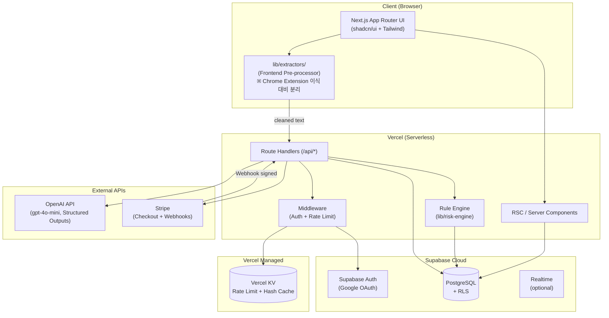
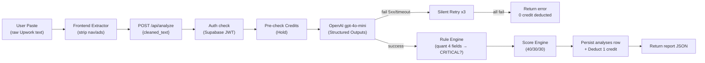
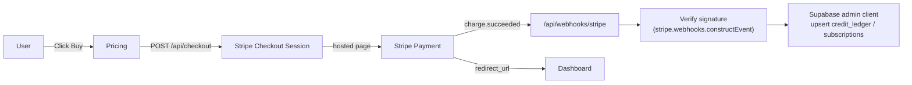
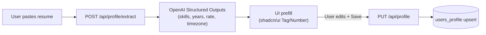

# 시스템 아키텍처 초안 — ConnectSaver

> Source: `spec/01_prd.md`, `idea_inquiry.md` Q1~Q6
> Status: Preview / 초안

---

## 1. 추천 기술 스택

| 구분 | 기술 | 선택 근거 |
|------|------|----------|
| Frontend | Next.js 14+ (App Router), React 18, TypeScript | SSR/RSC + Vercel 최적화, 단일 인스턴스에 API Routes 통합 가능 |
| Styling | Tailwind CSS 3.x + shadcn/ui (Radix 기반) | Token-aware 디자인, Tag/Number Input 기성 컴포넌트로 온보딩 UI 가속 |
| State (Client) | React Server Components 우선 + Zustand (얇게) | 대시보드 잔여 크레딧/이력 등 클라이언트 캐시는 Zustand. 서버 데이터는 RSC fetch + `revalidatePath` |
| Backend | Next.js Route Handlers (`app/api/*`) on Vercel Serverless | 풀스택 단일 저장소, MVP 운영 부담 최소 |
| DB / Auth / Realtime | Supabase (PostgreSQL 15, Supabase Auth, RLS, Realtime) | OAuth + RLS + Postgres가 한 콘솔에서, No-Code Admin 운영 가능 (Q4-A) |
| LLM | OpenAI `gpt-4o-mini` (Structured Outputs JSON Schema) | 비용/지연 최적, 정밀 필요 시 `gpt-4o` 스위치 설계 |
| Payment | Stripe Checkout (hosted) + Webhooks | 글로벌 소액 결제 + 정기 구독, 환불 GUI 활용 (Q4-A) |
| Rate Limit | Vercel KV (Upstash Redis 기반, Vercel 통합) | per-user/per-IP rate limit, Vercel 콘솔 단일 운영, `@vercel/kv` SDK 사용 |
| Error tracking | Sentry `[가정]` | OpenAI 실패 등 Silent Retry 가시성 확보 |
| Deploy | Vercel (Frontend + API), Supabase Cloud | CI/CD 자동, Preview Deploy |

## 2. 시스템 구성도



## 3. 주요 컴포넌트

### 3.1 Frontend (Next.js App Router)

```
src/
├── app/
│   ├── (marketing)/
│   │   ├── page.tsx                  # Landing
│   │   └── pricing/page.tsx
│   ├── (auth)/
│   │   └── login/page.tsx            # Google OAuth entry
│   ├── (app)/
│   │   ├── onboarding/page.tsx       # 이력서 붙여넣기 + extract
│   │   ├── dashboard/page.tsx        # 분석 입력 + 잔여 크레딧 + 이력
│   │   ├── account/page.tsx
│   │   └── analyses/[id]/page.tsx
│   ├── api/
│   │   ├── auth/callback/route.ts
│   │   ├── profile/extract/route.ts
│   │   ├── profile/route.ts
│   │   ├── analyze/route.ts
│   │   ├── analyses/route.ts
│   │   ├── credits/route.ts
│   │   ├── checkout/route.ts
│   │   ├── webhooks/stripe/route.ts
│   │   └── report-scam/route.ts
│   └── layout.tsx
├── components/
│   ├── ui/                           # shadcn/ui 기본
│   ├── report/RiskBadge.tsx
│   ├── report/MatchScoreGauge.tsx
│   └── analyze/PasteAnalyzer.tsx
├── lib/
│   ├── extractors/                   # ★ 입력 전처리 모듈 (Chrome Ext 이식 대비)
│   │   ├── upwork.ts                 # Upwork 페이지 텍스트 정제
│   │   └── index.ts
│   ├── risk-engine/                  # ★ Rule-based 정량 판정
│   │   ├── rules.ts
│   │   └── score.ts                  # Matching score (40/30/30)
│   ├── openai/
│   │   ├── client.ts
│   │   ├── schemas.ts                # Structured Outputs JSON Schema
│   │   └── prompts.ts                # system_prompts 로딩
│   ├── supabase/
│   │   ├── server.ts
│   │   ├── client.ts
│   │   └── admin.ts                  # service_role (서버 전용)
│   ├── stripe/
│   │   ├── client.ts
│   │   └── webhook.ts
│   └── rate-limit/kv.ts                # @vercel/kv 기반
├── middleware.ts                     # Auth + Rate limit
└── types/
```

### 3.2 핵심 모듈 책임

| 모듈 | 책임 |
|------|------|
| `lib/extractors/upwork.ts` | Upwork 공고 페이지에서 헤더/푸터/사이드바 제거 → client info + body 추출. Chrome Extension에서도 그대로 사용 가능하도록 DOM 의존성 X (text-only) |
| `lib/openai/schemas.ts` | Structured Outputs 스키마 정의. 1) Profile 추출용, 2) Analyze 통합용(정량 4필드 + 정성 5필드) |
| `lib/risk-engine/rules.ts` | OpenAI가 채워준 정량 4필드를 입력받아 `CRITICAL_RISK` boolean 산출 |
| `lib/risk-engine/score.ts` | 매칭 점수(40/30/30) 산출 — LLM의 raw 매칭 신호 + user_profile DB값 조합 |
| `lib/stripe/webhook.ts` | `checkout.session.completed`, `invoice.paid`, `customer.subscription.*`, `charge.refunded` 핸들링 + Supabase 동기화 |

### 3.3 Frontend 전처리 모듈 — `lib/extractors/upwork.ts` (v1 확정 구현)

DOM 의존 없음(text-only) → 브라우저/Chrome Extension/Node 어디서나 동일 결과. v1은 정규식 기반 헤더·푸터 컷오프 1차 방어선이며, 시스템 프롬프트(`analyze.v1`)가 잔여 노이즈를 2차로 흡수한다.

#### 3.3.1 소스 코드 (확정 본문)

```ts
/**
 * lib/extractors/upwork.ts
 * 정규식(Regex)을 이용한 Upwork 복사 덤프 데이터 전처리 모듈
 */

export function extractUpworkCoreText(rawText: string): string {
  if (!rawText) return "";

  // 1. 가독성 및 정규식 매칭 효율을 위해 연속된 공백, 탭, 연속 줄바꿈을 단일 공백으로 치환
  let cleanText = rawText.replace(/\s+/g, " ").trim();

  /**
   * 2. 헤더 노이즈 제거 정규식 (Header Cut-off Regex)
   * 'Job details' 또는 'Job Description'이 등장하기 전의 상단 네비게이션 메뉴 영역을 통째로 날립니다.
   * i 플래그로 대소문자 구분을 방지합니다.
   */
  const headerRegex = /.*?(Job details|Job Description|Back to job post)/i;
  const headerMatch = cleanText.match(headerRegex);

  if (headerMatch && headerMatch[1]) {
    // 매칭된 시작 키워드 지점부터 끝까지 텍스트를 슬라이싱
    const startIndex = cleanText.indexOf(headerMatch[1]);
    if (startIndex !== -1) {
      cleanText = cleanText.substring(startIndex);
    }
  }

  /**
   * 3. 푸터 노이즈 제거 정규식 (Footer Cut-off Regex)
   * 핵심 데이터(About the client)가 끝난 직후 등장하는 하단 카테고리 링크 및 약관 영역을 잘라냅니다.
   * 'Browse jobs', 'About Us', 'Terms of Service', '©' 기호 등이 기폭제가 됩니다.
   */
  const footerRegex = /(Browse jobs|About Us|Terms of Service|Accessibility|©\s*\d{4})/i;
  const footerMatch = cleanText.match(footerRegex);

  if (footerMatch && footerMatch[0]) {
    // 하단 노이즈가 시작되는 지점 직전까지만 잘라서 보존
    const endIndex = cleanText.indexOf(footerMatch[0]);
    if (endIndex !== -1) {
      cleanText = cleanText.substring(0, endIndex);
    }
  }

  return cleanText.trim();
}
```

#### 3.3.2 QA 골든 픽스처 — 샘플 raw dump

`tests/fixtures/upwork-sample.txt`에 그대로 보관. 단위 테스트는 이 입력을 `extractUpworkCoreText`에 통과시켜 (a) 'Find Work Deliver Work …' 헤더 영역이 사라졌고 (b) '© 2015 - 2026 Upwork® Global Inc.' 푸터가 사라졌으며 (c) "Telegram @scam_handler_test" 문구가 보존되었음을 단언한다.

```text
Find Work Deliver Work Managing Enterprise Notifications Messages Help Center
Search for Jobs, Freelancers, Agencies...
Home / Find Work / React Developer for AI SaaS Platform Integration
Job details
React Developer for AI SaaS Platform Integration
Posted 2 hours ago
Worldwide
Job Description:
We are looking for a talented React/Next.js developer to integrate an AI API wrapper into our existing SaaS platform. You will be responsible for building clean dashboard UI components using Tailwind and shadcn/ui.
Requirements:
- 3+ years of frontend experience
- Strong experience with OpenAI API integrations
- Must be able to work in EST timezone
Do not apply if you cannot start immediately. We prefer developers from US/Europe but open to global talent. Contact us via Telegram @scam_handler_test if you want fast review.
Hourly Range: $30.00 - $60.00
Project Length: 1 to 3 months
Skills and Expertise:
React, Next.js, TypeScript, Tailwind CSS, OpenAI API
Activity on this job:
Proposals: 20 to 50
Interviewing: 2
Invites sent: 5
About the client
Payment method verified
5.00 of 5 reviews
United States
45% hire rate, 3 open jobs
$10k+ total spent
12 freelancers hired, 2 active
Member since 2021
Client Feedback: "Great developer, will hire again."
Browse jobs Development & IT Front-End Development React
About Us Accessibility Terms of Service Privacy Policy Cookie Policy
© 2015 - 2026 Upwork® Global Inc.
```

#### 3.3.3 기대 출력 (위 픽스처 통과 후)

```text
Job details React Developer for AI SaaS Platform Integration Posted 2 hours ago Worldwide Job Description: We are looking for a talented React/Next.js developer to integrate an AI API wrapper into our existing SaaS platform. You will be responsible for building clean dashboard UI components using Tailwind and shadcn/ui. Requirements: - 3+ years of frontend experience - Strong experience with OpenAI API integrations - Must be able to work in EST timezone Do not apply if you cannot start immediately. We prefer developers from US/Europe but open to global talent. Contact us via Telegram @scam_handler_test if you want fast review. Hourly Range: $30.00 - $60.00 Project Length: 1 to 3 months Skills and Expertise: React, Next.js, TypeScript, Tailwind CSS, OpenAI API Activity on this job: Proposals: 20 to 50 Interviewing: 2 Invites sent: 5 About the client Payment method verified 5.00 of 5 reviews United States 45% hire rate, 3 open jobs $10k+ total spent 12 freelancers hired, 2 active Member since 2021 Client Feedback: "Great developer, will hire again."
```

#### 3.3.4 단위 테스트 케이스 (QA용 — `qa-engineer`가 작성)

| # | 케이스 | 단언 |
|---|--------|------|
| T1 | 위 골든 픽스처 입력 | 헤더 'Find Work … Job details' 좌측 노이즈 컷, '© 2015 - 2026' 우측 푸터 컷, 'Telegram @scam_handler_test' / '45% hire rate' / '$10k+ total spent' / '5.00 of 5 reviews' 보존 |
| T2 | 빈 문자열 입력 | 빈 문자열 반환 |
| T3 | 'Job details' 키워드 누락 입력 | 원본 trim된 형태 그대로 반환 (헤더 컷 미적용) |
| T4 | 'Browse jobs' 푸터만 존재 | 푸터만 컷, 헤더 영역은 보존 |
| T5 | 'Job Description' (대문자 D) 입력 | 정규식 i 플래그로 매칭, 동일하게 컷 |
| T6 | 'BACK TO JOB POST' (전 대문자) | i 플래그 매칭 확인 |

#### 3.3.5 한계 및 v2 트리거

- v1은 **단일 직무 페이지** 복붙만 지원. 검색 결과 페이지/My Jobs 페이지 복붙은 비결정적.
- Upwork이 헤더 라벨 또는 푸터 카테고리 명칭을 변경하면 cut-off가 동작하지 않는다 → 출시 후 1주 내 사용자 분석 로그(`analyses.is_reported`, 입력 길이 outlier)로 모니터링.
- v2 트리거: T1 픽스처 통과율 < 95% 또는 LLM 입력 토큰 p95 > 4k 초과 시. 대안은 (a) Cheerio로 DOM-aware 추출 (b) 'About the client' 같은 앵커 기반 region segmentation.

## 4. 데이터 흐름

### 4.1 Analysis Flow (Core)



### 4.2 Payment Flow



### 4.3 Profile Onboarding Flow



## 5. 인증/인가 모델

- **Identity provider**: Google OAuth via Supabase Auth (단일)
- **세션 전달**: Supabase가 발급한 JWT를 `@supabase/ssr` 쿠키 세션으로 보관 → Next.js Middleware가 매 요청 검증
- **인가 계층**:
  - Route Handler 진입 시 `getUser()`로 인증 사용자 식별
  - DB 접근은 Supabase RLS로 row-level 인가 (`auth.uid() = user_id`)
  - Stripe Webhook, OpenAI Key 등 Server-only path는 `service_role` 키 사용 (별도 admin client)

## 6. 비용/안정성 가드

| 가드 | 동작 |
|------|------|
| Input token cap | 분석 입력 텍스트 char length > 64k → 422 거절 / Pre-processor가 16k 이하로 정제 |
| Per-user rate limit | `/api/analyze` 60req/min, `/api/profile/extract` 5req/min (Vercel KV) |
| Soft caps | 주간 패스 100회 / 월 구독 500회 — Rule Engine 진입 전 체크 |
| Deduct-on-Success | Pre-check Hold → 성공 시점에만 차감 |
| Silent Retry | 5xx/timeout 시 backoff(200ms, 500ms, 1200ms) 최대 3회 |
| Stripe signature 검증 | Webhook 진입 첫 줄 `stripe.webhooks.constructEvent` — 실패 시 400 |
| Secrets | Vercel Encrypted Env Vars만 (Supabase service_role / OpenAI / Stripe Secret) |

## 7. 확장 고려사항

| 항목 | 현재 (MVP) | 확장 시점 |
|------|-----------|----------|
| Chrome Extension | `lib/extractors/` 모듈 분리 완료 | v2.0에서 Manifest V3 익스텐션이 동일 모듈을 import |
| Admin UI | 0 (Supabase Data Browser + Stripe Dashboard) | DAU>500 시 별도 Next.js admin segment 추가 |
| LLM upgrade | `gpt-4o-mini` 단일 | 고단가 사용자 대상 `gpt-4o` 옵션 (Pro tier 추후) |
| Multi-tenant | 단일 사용자 시트 | Agency 플랜 도입 시 `teams`, `memberships` 추가 |
| i18n | 영어 단일 raw string | `next-intl` 도입 → `en`, `es`, `pt` 우선 |
| 캐싱 | 없음 | 동일 공고 hash 분석 시 24h 캐시 [TBD] |

## 8. 환경변수 목록 (사전 정의)

| 변수 | 용도 | 노출 범위 |
|------|------|----------|
| `NEXT_PUBLIC_SUPABASE_URL` | Supabase URL | Client |
| `NEXT_PUBLIC_SUPABASE_ANON_KEY` | Supabase anon key | Client |
| `SUPABASE_SERVICE_ROLE_KEY` | 서버 admin 키 | Server only |
| `OPENAI_API_KEY` | OpenAI 호출 | Server only |
| `STRIPE_SECRET_KEY` | Stripe 서버 호출 | Server only |
| `STRIPE_WEBHOOK_SECRET` | Webhook 검증 | Server only |
| `NEXT_PUBLIC_STRIPE_PUBLISHABLE_KEY` | Checkout 진입 | Client |
| `KV_URL` / `KV_REST_API_URL` / `KV_REST_API_TOKEN` / `KV_REST_API_READ_ONLY_TOKEN` | Vercel KV (Rate Limit, Hash Cache) — Vercel가 자동 주입 | Server only |
| `SENTRY_DSN` | 에러 추적 `[가정]` | Server + Client |
| `SYSTEM_PROMPT_VERSION` | 기본 `system_prompts.active_version` 폴백 | Server only |
