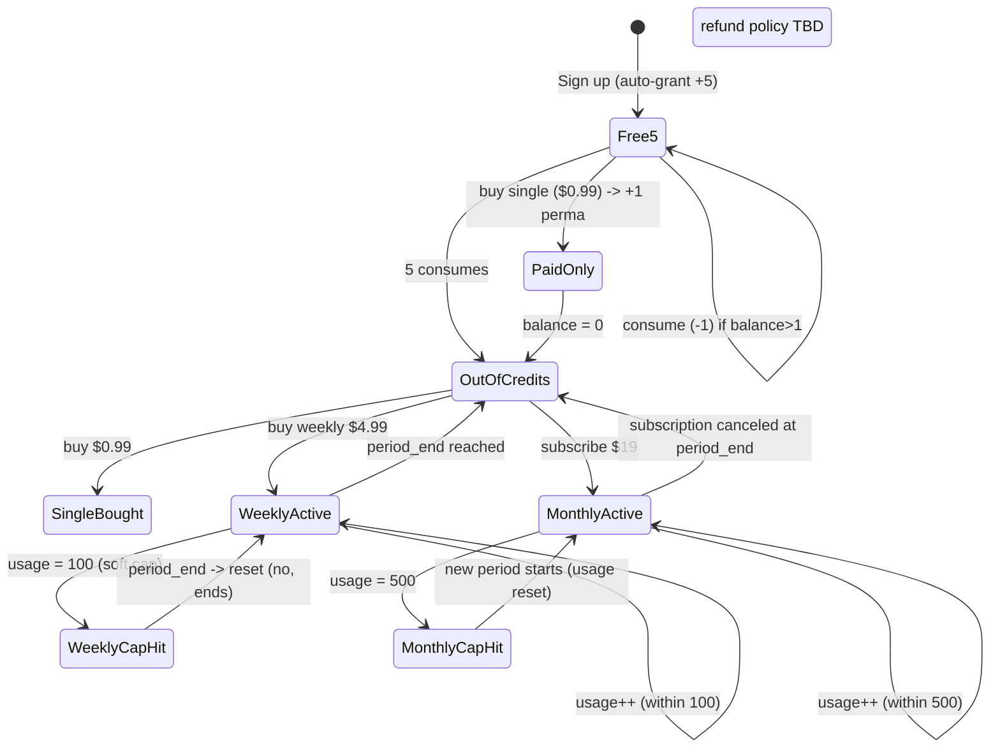
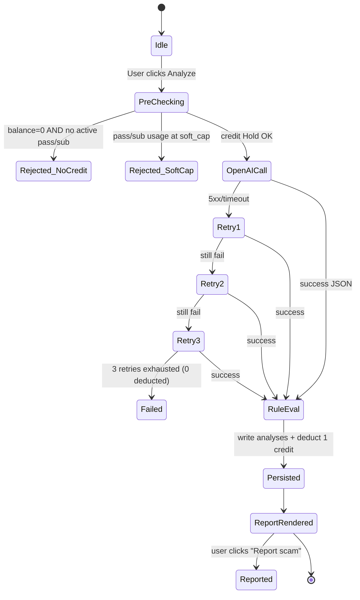

# 화면 설계 / 와이어프레임 — BidVett

> [PIVOT-01 rev2 — 2026-05-29] Pricing CTA / Account Billing / 결제 플로우 라벨을 Dodo Payments 기준으로 갱신했다. 결정 매트릭스는 `_workspace/00_input.md §11`.
> All user-facing copy is English (Q5).
> Design system: shadcn/ui (Radix) + Tailwind. Mobile-friendly but desktop-first (Upwork 사용자는 데스크톱 비중 큼).

---

## 1. 페이지 목록

| # | 페이지 | Route | 설명 | 주요 컴포넌트 / shadcn 의존성 |
|---|--------|-------|------|------------------------------|
| 1 | Landing | `/` | 가치 제안, CTA "Sign in with Google", Pricing 링크 | `Hero`, `Button`, `Card`, `Badge` |
| 2 | Pricing | `/pricing` | 3개 플랜 카드 (Single / Weekly Pass / Monthly) | `Card`, `Button`, `Tooltip` |
| 3 | Login | `/login` | Google OAuth 단일 버튼 | `Button` + Supabase Auth helper |
| 4 | Onboarding | `/onboarding` | 이력서 paste → AI extract → 편집 → Save | `Textarea`, `TagInput`, `NumberInput`, `Button`, `Toast` |
| 5 | Dashboard | `/dashboard` | 분석 입력, 잔여 크레딧 카드, 분석 이력 리스트 | `Card`, `Textarea`, `Button`, `Spinner`, `List` |
| 6 | Report Modal | (Dashboard 내) | 분석 결과 모달 — 위험 시 BLOCK, 안전 시 Score | `Dialog`, `Alert`, `Progress`, `Badge` |
| 7 | Analysis Detail | `/analyses/[id]` | 과거 분석 단건 상세 (Report와 동일 레이아웃) | 동일 |
| 8 | Account Settings | `/account` | 프로필 재편집, 결제 이력, 구독 취소 링크 (Dodo Customer Portal — `[TBD: confirm with Dodo docs]` for exact URL) | `Tabs`, `Card`, `Button` |
| 9 | Out-of-credits | (Dashboard banner / Pricing redirect) | 크레딧 소진 안내 | `Alert`, `Button` |
| 10 | 404 / 500 | `/_not-found`, `error.tsx` | | `Card`, `Button` |

## 2. 페이지별 레이아웃

### 2.1 Landing — `/`

```
┌────────────────────────────────────────────────────────────────┐
│ [BidVett]                       Pricing · Login           │
├────────────────────────────────────────────────────────────────┤
│                                                                │
│   STOP WASTING CONNECTS ON GHOST JOBS.                         │
│   Paste a job. Get a 3-second double-risk verdict.             │
│                                                                │
│   [ Sign in with Google ]                                      │
│                                                                │
│   ✓ 5 free analyses on signup                                  │
│   ✓ $0.99 single-shot / $4.99 weekly / $19 monthly             │
│                                                                │
├────────────────────────────────────────────────────────────────┤
│  [How it works — 3 step illustration]                          │
│  1. Paste Upwork page → 2. Dual screening → 3. Apply with edge │
├────────────────────────────────────────────────────────────────┤
│  [Sample report screenshot]                                    │
│  Risk: SAFE   |   Match: 82   |   Action tip preview...        │
├────────────────────────────────────────────────────────────────┤
│  Footer  ·  Privacy  ·  Terms                                 │
└────────────────────────────────────────────────────────────────┘
```

### 2.2 Pricing — `/pricing`

```
┌────────────────────────────────────────────────────────────────┐
│ Plans that match your application rhythm                       │
├──────────────────┬──────────────────┬──────────────────────────┤
│  Single $0.99    │  Weekly $4.99    │  Monthly $19             │
│  +1 credit       │  7 days unlim    │  30 days unlim           │
│  (never expires) │  (soft cap 100)  │  (soft cap 500)          │
│  [Buy]           │  [Start Pass]    │  [Subscribe]             │
└──────────────────┴──────────────────┴──────────────────────────┘
```

### 2.3 Login — `/login`

```
┌────────────────────────────────────────┐
│       Welcome back to BidVett     │
│                                        │
│      [ G Continue with Google ]        │
│                                        │
│      By continuing you accept Terms.   │
└────────────────────────────────────────┘
```

### 2.4 Onboarding — `/onboarding`

```
┌────────────────────────────────────────────────────────────────┐
│ Step 1 / 1  ·  Set up your profile                             │
├────────────────────────────────────────────────────────────────┤
│ Paste your resume or Upwork bio:                               │
│ ┌────────────────────────────────────────────────────────────┐ │
│ │ (Textarea, 12 rows)                                        │ │
│ └────────────────────────────────────────────────────────────┘ │
│                                       [Extract with AI →]      │
├────────────────────────────────────────────────────────────────┤
│ (after extract — shadcn/ui form)                               │
│ Skills        [React] [Node.js] [TypeScript]   + add tag       │
│ Years of exp  [  4  ]                                          │
│ Hourly rate $ [ 45  ]   /hr                                    │
│ Timezone      [ UTC+9                ▼]                        │
│                                                                │
│                                       [Save and continue →]    │
└────────────────────────────────────────────────────────────────┘
```

### 2.5 Dashboard — `/dashboard`

```
┌────────────────────────────────────────────────────────────────┐
│ BidVett        Dashboard   History   Pricing   [Avatar▾]  │
├────────────────────────────────────────────────────────────────┤
│  Credits: 2 left          Weekly Pass: — none                  │
│  [Buy more]                                                    │
├────────────────────────────────────────────────────────────────┤
│  Paste an Upwork job posting (entire page):                    │
│  ┌────────────────────────────────────────────────────────────┐│
│  │ (Textarea, 14 rows, monospace)                             ││
│  │                                                            ││
│  └────────────────────────────────────────────────────────────┘│
│                                            [ Analyze ]         │
├────────────────────────────────────────────────────────────────┤
│  Recent analyses                                               │
│  • SAFE     · Match 82  · 2026-05-27 11:24  →                  │
│  • DANGER   · BLOCKED   · 2026-05-27 10:02  →                  │
│  • WARNING  · Match 54  · 2026-05-26 22:45  →                  │
└────────────────────────────────────────────────────────────────┘
```

### 2.6 Report Modal (Safe)

```
┌────────────────────────────────────────────────────────────────┐
│ Analysis result                                            [×] │
├────────────────────────────────────────────────────────────────┤
│  Backend risk:  ✓ No critical rules triggered                  │
│  AI risk:       ● SAFE                                         │
│                                                                │
│  Match Score                                                   │
│  ████████████████████░░░  82 / 100                             │
│                                                                │
│  Why this score                                                │
│  Strong skill overlap (React, Node.js, TS). Budget within 10%  │
│  of your $45/hr target. Timezone overlap ~4h.                  │
│                                                                │
│  Action tip                                                    │
│  Lead with your React perf case. Quote $45/hr — prior hires    │
│  averaged $42-48.                                              │
│                                                                │
│  [ Open Upwork ↗ ]   [ Report scam ]   [ Close ]               │
└────────────────────────────────────────────────────────────────┘
```

### 2.7 Report Modal (Risk)

```
┌────────────────────────────────────────────────────────────────┐
│  ⚠  DO NOT APPLY                                          [×]  │
├────────────────────────────────────────────────────────────────┤
│  Backend risk:  CRITICAL (LOW_HIRE_RATE, PAYMENT_UNVERIFIED)   │
│  AI risk:       ● DANGER                                       │
│                                                                │
│  Red flags                                                     │
│  • Client asks to move communication to Telegram.              │
│  • Requests upfront deposit before NDA.                        │
│                                                                │
│  Tip: skip and report to Upwork TOS team.                      │
│                                                                │
│  [ Report scam ]                          [ Close ]            │
└────────────────────────────────────────────────────────────────┘
```

### 2.8 Account Settings — `/account`

```
┌────────────────────────────────────────────────────────────────┐
│ Account Settings                                               │
├────────────────────────────────────────────────────────────────┤
│ [Profile] [Billing] [Notifications]                            │
├────────────────────────────────────────────────────────────────┤
│ (Profile tab)                                                  │
│  Skills        [React] [Node.js] ...                           │
│  Years of exp  [ 4 ]                                           │
│  Hourly rate $ [45]                                            │
│  Timezone      [UTC+9 ▼]                                       │
│  [Save]                                                        │
├────────────────────────────────────────────────────────────────┤
│ (Billing tab)                                                  │
│  Active plan: Weekly Pass (expires 2026-06-03, 14/100 used)    │
│  [Manage in Dodo Customer Portal ↗]                            │
│  Payment history: see Dodo Payments receipts in your email.    │
│  Taxes (VAT/GST/Sales Tax): handled by Dodo Payments (MoR).    │
└────────────────────────────────────────────────────────────────┘
```

## 3. 사용자 플로우

```mermaid
flowchart LR
  L[Landing /] -->|Sign in with Google| LG[Google OAuth]
  LG --> CB[/api/auth/callback/]
  CB -->|new user| OB[/onboarding/]
  CB -->|existing user| DB[/dashboard/]
  OB -->|Save profile| DB
  DB -->|Paste + Analyze| A[/api/analyze/]
  A -->|safe| RS[Report Modal: Safe]
  A -->|risk| RD[Report Modal: Block]
  A -->|out of credits| PR[/pricing/]
  PR -->|Checkout| DC[Dodo Hosted Checkout]
  DC -->|webhook ok<br/>payment.succeeded / subscription.active| DB
  RD -->|Report scam| RPT[/api/report-scam/]
  RS -->|Report scam| RPT
  DB -->|Account| AC[/account/]
  AC -->|Dodo portal| DP[Dodo Customer Portal<br/>[TBD URL]]
```

## 4. 핵심 상태 다이어그램

### 4.1 Credit / Pass / Subscription Status



### 4.2 Analysis Lifecycle



## 5. 접근성 / i18n / UX 메모

- 모든 인터랙티브 요소는 키보드 탐색 가능 (shadcn/ui 기본 보장)
- Risk Modal은 색맹 사용자 대비 텍스트 라벨 병기 (`DANGER`, `SAFE` 텍스트 우선)
- 모든 카피는 영어 단일. 추후 i18n은 `next-intl`로 키 추출 [TBD]
- Toast 알림은 우상단 (Soft cap, OpenAI 오류, 결제 완료)
- Loading: Analyze 버튼 클릭 시 모달 내 스피너 + "Analyzing... up to 3s" 안내

## 6. 가정 / 미정

- `[가정]` Account Settings의 Notifications 탭은 v1.0에서 활성 (Resend 채택 시).
- `[TBD]` 환불 정책 필요 여부 및 카피 (법무/운영 검토 후 결정).
- `[TBD]` 모바일 뷰의 Analyze Textarea 키보드 가림 처리.
