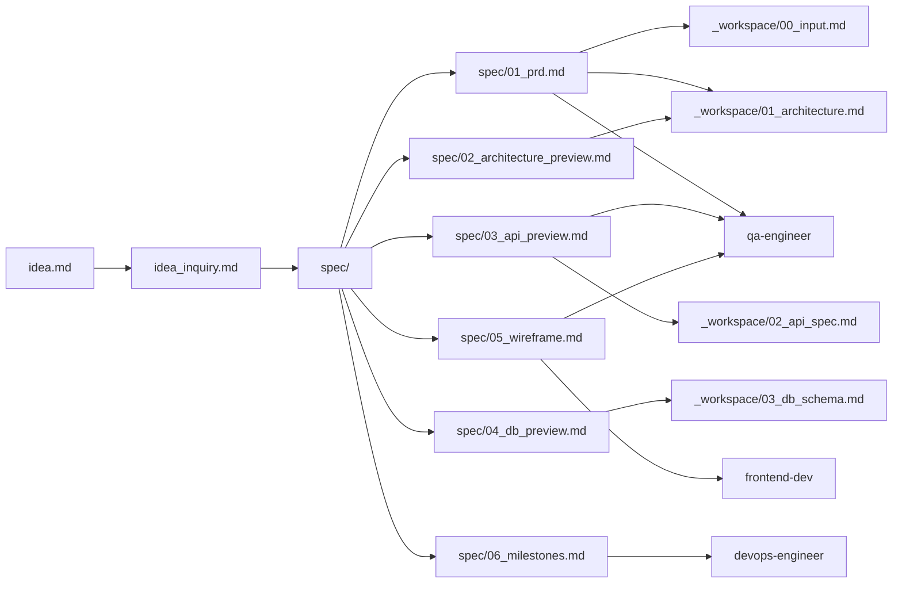

# Spec → Workspace 매핑 가이드 — ConnectSaver

> spec/는 사전 기획/설계 **프리뷰**(초안)이고, `_workspace/`는 구현 단계의 **확정본**이다.
> 상충 시 `_workspace/`가 우선한다.

---

## 0. Spec Freeze 상태

> 🔒 **FROZEN-rev2 — 2026-05-29** (PIVOT-01: Stripe → Dodo Payments 반영)

**변경 이력**
> - v1 (2026-05-27): Stripe 채택
> - v2 (2026-05-29): Dodo Payments로 전환, `_workspace/00_input.md §11` 참조

스펙 동결 시점에 확정된 의사결정 (rev 2 기준):
- Q1~Q6 (`idea_inquiry.md` ✅ LGTM)
- Rate-limit 인프라: **Vercel KV** (`@vercel/kv`)
- System Prompt v1 (`analyze.v1`): **`spec/03 §7` 본문 확정**
- Frontend 전처리 모듈 (`lib/extractors/upwork.ts` v1): **`spec/02 §3.3` 소스 코드 + 골든 픽스처 확정**
- **Payment**: Dodo Payments Hosted Checkout + Standard Webhooks (PIVOT-01)
- Webhook signature: Standard Webhooks 스펙 (`webhook-id` / `webhook-timestamp` / `webhook-signature` HMAC-SHA256, `standardwebhooks` npm 권장)
- 세금: Dodo가 Merchant of Record로 자동 처리 (별도 활성화 불필요)

`_workspace/`로 명시적으로 이관된 항목 (이후 architect가 처리):
- `profile_extract.v1` 시스템 프롬프트 본문 — 4필드 추출용 (`skills[]`, `years_of_experience`, `target_hourly_rate`, `timezone`). `spec/04` seed 표에 TBD로 등록되어 있음.
- Dodo Payments 제품 카탈로그 ID 발급(`single_credit_099` / `weekly_pass_499` / `monthly_19`) — devops가 Dodo Dashboard에서 생성 후 환경변수 주입 (`_workspace/05_deploy_guide.md §4`).
- Dodo test/live mode 키 발급 절차 명시 (deploy guide §4).
- Dodo Customer Portal URL 형식 확인 — 미제공 시 support 이메일 안내로 대체.
- 그 외 spec/ 내 `[TBD]`로 표기된 모든 항목 (GDPR 흐름, Email 채널, 환불 약관 카피, 모바일 키보드 처리 등) — `_workspace/` 단계에서 결정 시점·담당·기준 부여.

스펙 변경 금지. 변경 필요 시 `_workspace/00_input.md`에 상충 사유를 기록한 뒤 `_workspace/`에서 우선 적용한다.

---

## 1. 문서 관계도

## 2. 에이전트별 spec/ 활용 프로토콜

| 에이전트 | 참조할 spec/ 문서 | 활용 방식 |
|---------|------------------|---------|
| architect | 01, 02, 03, 04 | `_workspace/` 상세 설계의 입력 초안으로 활용. spec/의 가정·TBD 항목은 `_workspace/`에서 검증/확정 |
| frontend-dev | 01, 05 | 페이지 구성, 컴포넌트 분류, shadcn/ui 의존성. `lib/extractors/` 분리 원칙 준수 |
| backend-dev | 01, 03, 04 | API/DB 명세, Rule Engine 룰 정의, Dodo Standard Webhooks 멱등성 (`dodo_events` PK = `webhook-id`). RLS 정책은 반드시 적용 |
| qa-engineer | 01, 05 | 사용자 시나리오 → E2E 테스트, Acceptance Criteria → 단위/통합 케이스 |
| devops-engineer | 02, 06 | 환경변수 목록, 마일스톤별 배포 게이트, Vercel + Supabase 설정 |

## 3. spec/ → _workspace/ 승격 규칙

1. `architect`가 `_workspace/`를 작성할 때 `spec/`를 **반드시 먼저 정독**한다 (architect.md의 사전 검증 모드 참고).
2. `spec/`의 가정 사항(`[가정]` 표기)은 `_workspace/`에서 검증 — 가능하면 결정으로 승격, 안 되면 그대로 [TBD] 유지.
3. `spec/`의 미정 항목(`[TBD]`)은 `_workspace/`에서 결정 시점·담당·기준을 명시한다.
4. `spec/`와 `_workspace/`가 상충하면 `_workspace/`가 우선. 단, 상충의 사유는 `_workspace/00_input.md` 또는 `_workspace/06_review_report.md`에 1줄 이상 기록.

## 4. 문서별 핵심 책임 한 줄 요약

| 파일 | 한 줄 요약 |
|------|----------|
| `spec/01_prd.md` | 제품 무엇/누구/왜 + P0~P2 기능 + NFR + 사용자 여정 + Out of Scope |
| `spec/02_architecture_preview.md` | 기술 스택 근거 + 시스템 구성도 + 모듈 책임 + 비용/안정성 가드 + 환경변수 |
| `spec/03_api_preview.md` | 9개 핵심 엔드포인트 + 요청/응답 예시 + 에러 코드 + OpenAI Structured Outputs 스키마 + Dodo Standard Webhooks (rev 2) |
| `spec/04_db_preview.md` | 6개 테이블 컬럼 + ERD + 인덱스 + RLS 정책 + 트리거/RPC (`stripe_events` → `dodo_events`, rev 2) |
| `spec/05_wireframe.md` | 10개 페이지 ASCII 와이어프레임 + 플로우 + 상태 머신 |
| `spec/06_milestones.md` | MVP 2주 + v1.0 +2주 + 칸반 + 기술 부채 (rev 2: TD-7 Stripe Tax → Dodo MoR로 종결) |

## 5. 사용 가이드

- spec/ 검토 완료 후 `/fullstack-webapp` 호출 → architect가 spec/를 사전 검증 → 통과 시 `_workspace/` 작성 → 구현 단계 진입.
- spec/ 수정이 필요하면 직접 편집 또는 `/spec_check`을 재호출해 갱신.
- spec/의 핵심 결정(Q1~Q6)은 `idea_inquiry.md`에 원본이 있으니, 변경 시 inquiry도 함께 갱신할 것.
